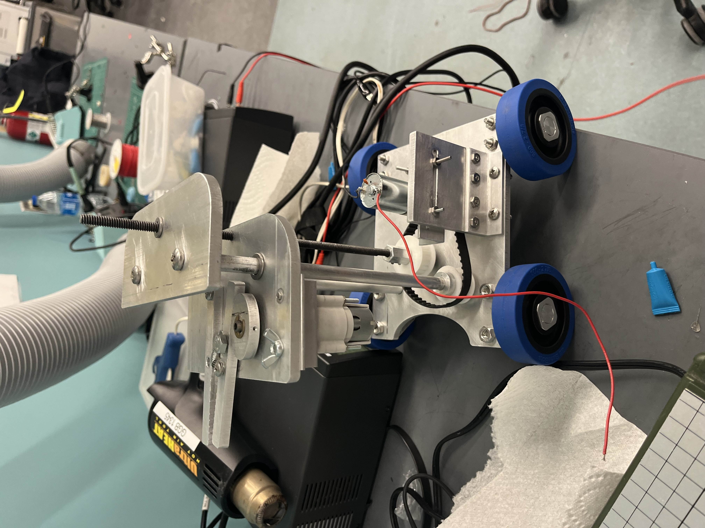

# Rover-Based Manipulator Prototype
This project is a rover-based manipulator designed and built for a manufacturing and design course.

---

## Overview

The system features a custom drivetrain, a lead-screw lift platform, and a cam-actuated claw mechanism. The project emphasized CAD-based design, precision fabrication, and force/torque analysis to support reliable assembly and actuation.

